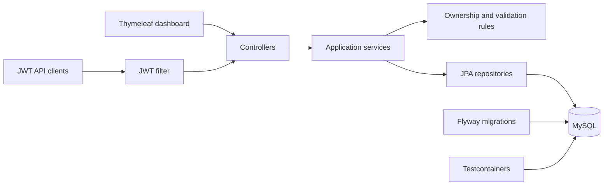

# Expense Intelligence

[](https://github.com/xyl0619/Expense/actions/workflows/ci.yml)

Expense Intelligence is a full-stack Spring Boot application for transaction tracking, category budgets, and server-side spending analytics. It is designed as a portfolio project that demonstrates domain modelling, authorization boundaries, database migrations, testing, API documentation, containerization, and continuous integration—not only CRUD screens.

## What it demonstrates

- Spring Boot 3, Spring MVC, Spring Security, JPA/Hibernate, and MySQL
- Hybrid form-login and JWT Bearer authentication
- Per-user authorization enforced in the service layer
- Monthly category budgets with utilization and over-budget detection
- Date/category/amount filtering with database pagination and sorting
- Server-side category breakdowns, averages, totals, and zero-filled monthly trends
- Flyway-managed and Hibernate-validated database schema
- RFC-style structured API errors and Jakarta Bean Validation
- OpenAPI/Swagger documentation
- Unit tests plus disposable real-MySQL integration tests with Testcontainers
- Multi-stage Docker build, Docker Compose, GitHub Actions, and Dependabot

## Architecture



The controllers translate HTTP requests, application services own business and authorization rules, and repositories are responsible only for persistence. Analytics and budget calculations are performed on server-owned user data rather than trusting browser calculations.

## Main capabilities

### Expense management

- Create, update, delete, and export personal expenses
- Validate positive monetary values and bounded text fields
- Prevent users from modifying records they do not own
- Filter by category, date range, and amount range
- Paginate and sort results in the database
- Escape CSV fields and neutralize spreadsheet-formula injection

### Budgets and analytics

- Upsert one category budget per user and month
- Calculate spend, remaining amount, utilization percentage, and exceeded state
- Aggregate totals, average transaction value, top category, category percentages, and monthly trends
- Reject invalid or excessively large analytics ranges

### Security

- BCrypt password hashing
- Session login for the server-rendered UI
- JWT authentication for API clients
- CSRF protection retained for browser sessions
- Runtime-only database credentials and JWT signing key
- DTO boundaries prevent administrator APIs from exposing password hashes

## Quick start with Docker

Requirements: Docker Desktop or another Docker Compose-compatible runtime.

1. Copy the environment template:

   ```powershell
   Copy-Item .env.example .env
   ```

2. Generate a 64-byte Base64 JWT signing key and place it in `.env`:

   ```shell
   openssl rand -base64 64
   ```

   PowerShell alternative:

   ```powershell
   $bytes = New-Object byte[] 64
   $rng = [Security.Cryptography.RandomNumberGenerator]::Create()
   $rng.GetBytes($bytes)
   [Convert]::ToBase64String($bytes)
   ```

3. Replace every placeholder in `.env`, then start the stack:

   ```shell
   docker compose up --build
   ```

4. Open:

   - Application: `http://localhost:8080`
   - Swagger UI: `http://localhost:8080/swagger-ui.html`

Flyway creates the schema and initial roles automatically. MySQL data is stored in the named `expense_mysql_data` volume.

## Run locally without Docker

Requirements:

- Java 17+
- Maven 3.6+
- MySQL 8.x

Required environment variables:

| Variable | Required | Default / purpose |
| --- | --- | --- |
| `DB_PASSWORD` | Yes | MySQL password |
| `JWT_SECRET` | Yes | Base64-encoded key containing at least 64 random bytes |
| `DB_URL` | No | Local `expense_management` MySQL database |
| `DB_USERNAME` | No | `root` |
| `JWT_EXPIRATION_MS` | No | `86400000` (24 hours) |
| `JPA_SHOW_SQL` | No | `false` |

Create an empty `expense_management` database, set the required variables, and run:

```shell
mvn spring-boot:run
```

Flyway applies migrations from `src/main/resources/db/migration`; Hibernate then validates that the resulting schema matches the entity model.

## API overview

| Method | Endpoint | Purpose |
| --- | --- | --- |
| `POST` | `/api/auth/signup` | Register an account |
| `POST` | `/api/auth/signin` | Obtain a JWT |
| `GET` | `/api/expenses/search` | Filtered, sorted, paginated expenses |
| `POST` | `/api/expenses` | Create an expense |
| `PUT` | `/api/expenses/{id}` | Update an owned expense |
| `DELETE` | `/api/expenses/{id}` | Delete an owned expense |
| `GET` | `/api/expenses/report` | Safe CSV export |
| `GET` | `/api/analytics/summary` | Category and monthly aggregations |
| `GET` | `/api/budgets?month=YYYY-MM` | Monthly budget status |
| `POST` | `/api/budgets` | Create or update a category budget |
| `DELETE` | `/api/budgets/{id}` | Delete an owned budget |

Authenticate an API request with:

```text
Authorization: Bearer <token>
```

The complete interactive contract is generated at `/swagger-ui.html`.

## Testing

Run all tests:

```shell
mvn verify
```

The suite includes:

- Unit tests for JWT signing, analytics aggregation, budget calculations, DTO serialization, controller delegation, and ownership enforcement
- A MySQL Testcontainers integration test that applies the real Flyway migrations, validates the schema, and persists users, expenses, and budgets

If Docker is unavailable, the Testcontainers test is skipped locally; GitHub Actions runs it on every push and pull request.

## Delivery pipeline

The CI workflow performs the following on Java 17:

1. Resolves dependencies through Maven caching
2. Runs unit and MySQL integration tests
3. Packages the executable Spring Boot JAR
4. Builds the production Docker image

Dependabot monitors Maven, Docker, and GitHub Actions dependencies weekly.

## Project structure

```text
src/main/java/com/in6206/
├── config/       Security and OpenAPI configuration
├── controller/   HTTP and view adapters
├── exception/    Structured error model and exception mapping
├── model/        JPA domain entities
├── payload/      Validated request and response DTOs
├── repository/   Persistence boundaries
├── security/     JWT and user principal implementation
└── service/      Business rules, analytics, budgets, and authorization

src/main/resources/
├── db/migration/ Versioned Flyway schema
└── templates/    Server-rendered application UI
```
