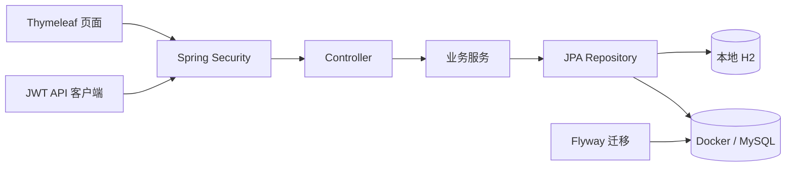

# 轻账（Expense Intelligence）

[](https://github.com/xyl0619/Expense/actions/workflows/ci.yml)

轻账是一套可直接运行的个人支出与预算管理系统。项目使用 Spring Boot 提供页面、业务接口、权限控制和数据持久化，支持本地 H2 数据库，也支持通过 Docker Compose 运行 MySQL。

## 功能概览

### 普通用户

- 注册、登录和退出
- 新增、编辑、删除个人支出
- 按日期、分类和金额筛选支出
- 分页查看记录并导出 CSV
- 设置每月分类预算
- 查看预算使用率和超支状态
- 查看支出总额、平均值、最高分类、分类占比和月度趋势

### 管理员

- 使用启动配置安全创建首个管理员
- 查看全部用户及其身份
- 删除普通用户，并同步清理其预算和支出
- 保护管理员账号，禁止从管理页面删除
- 查看包含所属用户的全局支出报表
- 导出全局 CSV 并查看分类、月份统计图表

## 技术栈

| 部分 | 技术 |
| --- | --- |
| 后端 | Java 17、Spring Boot 3.2、Spring MVC |
| 安全 | Spring Security、表单会话、JWT、CSRF、BCrypt |
| 页面 | Thymeleaf、原生 JavaScript、响应式 CSS |
| 图表 | Chart.js WebJar（不依赖外部 CDN） |
| 数据 | Spring Data JPA、H2、MySQL 8、Flyway |
| 接口文档 | Springdoc OpenAPI / Swagger UI |
| 测试 | JUnit 5、Mockito、H2、Testcontainers |
| 交付 | Docker、Docker Compose、GitHub Actions、Dependabot |

## 系统结构



权限和数据归属由后端校验。浏览器传入的用户 ID 不会被用于决定数据所有权，普通用户只能访问自己的支出和预算。

## 方式一：本地直接运行（推荐新手使用）

### 环境要求

- Java 17 或更高版本
- Maven 3.6 或更高版本

确认环境：

```powershell
java -version
mvn -version
```

### 启动

在项目目录执行：

```powershell
mvn spring-boot:run
```

打开：

- 首页：<http://localhost:8080>
- 登录：<http://localhost:8080/login>
- 注册：<http://localhost:8080/register>
- Swagger：<http://localhost:8080/swagger-ui.html>

默认使用本地 H2 文件数据库，不需要安装 MySQL。数据保存在：

```text
data/expense.mv.db
```

`data/` 已被 Git 忽略，不会上传账号、密码哈希或账单数据。

### 首次创建管理员

新数据库默认没有硬编码管理员。第一次启动时，在同一个 PowerShell 窗口设置以下变量：

```powershell
$env:ADMIN_USERNAME="admin"
$env:ADMIN_EMAIL="替换成你的邮箱"
$env:ADMIN_PASSWORD="替换成你自己的强密码"
mvn spring-boot:run
```

要求：

- 用户名为 3–20 个字符
- 邮箱必须是有效格式，最长 50 个字符
- 管理员密码为 12–72 个 UTF-8 字节
- 不要使用其他网站正在使用的密码

看到下面的日志表示管理员已就绪：

```text
Administrator account is ready: admin
```

管理员创建后会保存在 H2 数据库。以后即使不再设置这些环境变量，仍可使用原账号密码登录。启动配置只用于创建或首次提升管理员，不会在每次重启时重置已有管理员密码。

## 方式二：Docker Compose + MySQL

### 环境要求

- Docker Desktop 已安装并处于运行状态
- `docker version` 能同时显示 Client 和 Server

### 1. 创建环境配置

复制模板：

```powershell
Copy-Item .env.example .env
```

编辑 `.env`，替换所有 `replace-with-...` 内容：

```env
DB_PASSWORD=设置应用数据库密码
MYSQL_ROOT_PASSWORD=设置MySQL管理员密码
JWT_SECRET=填写Base64格式的随机密钥
ADMIN_USERNAME=admin
ADMIN_EMAIL=填写你的管理员邮箱
ADMIN_PASSWORD=设置管理员登录密码
```

生成 JWT 密钥的 PowerShell 示例：

```powershell
$jwtBytes = New-Object byte[] 64
$jwtGenerator = [Security.Cryptography.RandomNumberGenerator]::Create()
$jwtGenerator.GetBytes($jwtBytes)
[Convert]::ToBase64String($jwtBytes)
$jwtGenerator.Dispose()
```

将输出的整串 Base64 内容填入 `JWT_SECRET`。

### 2. 启动

```powershell
docker compose up --build
```

Compose 会启动：

- `app`：Spring Boot 应用，端口 `8080`
- `mysql`：MySQL 数据库，端口 `3306`

MySQL 健康检查通过后应用才会启动。Flyway 会自动创建表结构和基础角色，随后创建 `.env` 中配置的管理员。

### 3. 停止

在前台运行时按 `Ctrl+C`，或执行：

```powershell
docker compose down
```

MySQL 数据保存在 Docker 卷 `expense_mysql_data` 中，普通 `down` 不会删除数据。

以下命令会连同数据库卷一起删除，请确认不再需要数据后再执行：

```powershell
docker compose down -v
```

## H2 和 Docker MySQL 的区别

| 项目 | 本地 H2 | Docker MySQL |
| --- | --- | --- |
| 启动难度 | 最低 | 需要 Docker Desktop |
| 数据位置 | `data/expense.mv.db` | Docker 卷 `expense_mysql_data` |
| 表结构管理 | Hibernate `update` | Flyway 迁移 + Hibernate `validate` |
| 适合场景 | 学习、本地开发 | 完整环境、部署演示 |

两个数据库彼此独立。H2 中的账号和账单不会自动迁移到 Docker MySQL，反之亦然。

## 环境变量

| 变量 | 本地默认值 | MySQL / Docker | 用途 |
| --- | --- | --- | --- |
| `SERVER_PORT` | `8080` | 可选 | 应用端口 |
| `DB_URL` | 本地 H2 文件 | Compose 自动设置 | JDBC 地址 |
| `DB_USERNAME` | `sa` | Compose 自动设置 | 数据库账号 |
| `DB_PASSWORD` | 空 | 必填 | 数据库密码 |
| `MYSQL_ROOT_PASSWORD` | 不使用 | 必填 | MySQL root 密码 |
| `JWT_SECRET` | 仅限本地开发的默认密钥 | 必填 | JWT 签名密钥 |
| `JWT_EXPIRATION_MS` | `86400000` | 可选 | JWT 有效期，默认 24 小时 |
| `ADMIN_USERNAME` | 不创建管理员 | 必填 | 首个管理员用户名 |
| `ADMIN_EMAIL` | 不创建管理员 | 必填 | 首个管理员邮箱 |
| `ADMIN_PASSWORD` | 不创建管理员 | 必填 | 首个管理员密码 |
| `JPA_SHOW_SQL` | `false` | 可选 | 是否打印 SQL |

生产或联网环境必须提供独立的 `JWT_SECRET`、数据库密码和管理员密码，不能使用示例值。

## 页面权限

| 页面 | 访问权限 |
| --- | --- |
| `/` | 公开 |
| `/register` | 公开 |
| `/login` | 公开 |
| `/dashboard` | 已登录用户 |
| `/admin` | 管理员 |
| `/swagger-ui.html` | 公开接口文档 |

普通用户访问 `/admin` 时会返回仪表盘并显示“没有管理员权限”。管理员登录后，仪表盘右上角会出现“管理”入口。

## API 概览

| 方法 | 地址 | 说明 |
| --- | --- | --- |
| `POST` | `/api/auth/signup` | 注册普通用户 |
| `POST` | `/api/auth/signin` | 获取 JWT |
| `GET` | `/api/expenses/search` | 筛选、排序、分页查询支出 |
| `POST` | `/api/expenses` | 新增支出 |
| `PUT` | `/api/expenses/{id}` | 修改本人支出 |
| `DELETE` | `/api/expenses/{id}` | 删除本人支出 |
| `GET` | `/api/expenses/report` | 导出本人 CSV |
| `GET` | `/api/analytics/summary` | 支出统计与趋势 |
| `GET` | `/api/budgets?month=YYYY-MM` | 查询月度预算 |
| `POST` | `/api/budgets` | 新增或更新预算 |
| `DELETE` | `/api/budgets/{id}` | 删除本人预算 |
| `GET` | `/api/admin/users` | 管理员查看用户 |
| `DELETE` | `/api/admin/users/{id}` | 管理员删除普通用户 |
| `GET` | `/api/admin/expenses/report` | 管理员查看全局支出 |

JWT 调用格式：

```text
Authorization: Bearer <token>
```

浏览器页面使用安全会话和 CSRF；独立 API 客户端可以使用 JWT。

## 安全设计

- 密码使用 BCrypt 哈希，数据库不保存明文密码
- 管理员密码由运行环境提供，不写死在源码中
- 管理员账号不可通过管理页面删除
- 用户数据归属在服务层校验
- 浏览器写操作保留 CSRF 防护
- JWT 使用 Base64 随机密钥签名
- 管理员 DTO 不返回密码或密码哈希
- CSV 导出会转义字段并防止表格公式注入
- `.env`、`data/`、日志和构建产物均被 Git 忽略

## 测试与构建

运行全部测试并生成可执行 JAR：

```powershell
mvn verify
```

测试覆盖：

- 用户注册、密码哈希和管理员初始化
- 管理员删除保护及 H2 关联数据清理
- 支出所有权、筛选和修改规则
- 预算计算与超支判断
- 分析汇总和日期范围限制
- JWT 生成与校验
- Controller 委托和 DTO 数据边界
- MySQL + Flyway Testcontainers 集成

如果本机 Docker 不可用，MySQL Testcontainers 测试会跳过；GitHub Actions 会在推送和 Pull Request 时执行完整验证并构建生产镜像。

构建结果位于：

```text
target/expense-tracker-0.0.1-SNAPSHOT.jar
```

## 项目目录

```text
Expense/
├─ .github/                 GitHub Actions 与 Dependabot
├─ .mvn/                    项目级 Maven 连接配置
├─ src/main/java/com/in6206/
│  ├─ config/               安全、OpenAPI、管理员初始化
│  ├─ controller/           页面与 REST 接口
│  ├─ exception/            统一异常响应
│  ├─ model/                JPA 实体
│  ├─ payload/              请求与响应 DTO
│  ├─ repository/           数据访问
│  ├─ security/             JWT 与用户身份
│  └─ service/              业务与权限规则
├─ src/main/resources/
│  ├─ db/migration/         MySQL Flyway 迁移
│  ├─ static/               CSS 与 JavaScript
│  ├─ templates/            Thymeleaf 页面
│  ├─ application.yml       默认 H2 配置
│  └─ application-mysql.yml MySQL Profile
├─ src/test/                单元与集成测试
├─ .env.example             Docker 环境变量模板
├─ compose.yml              应用 + MySQL 编排
├─ Dockerfile               多阶段生产镜像
└─ pom.xml                  Maven 项目配置
```

## 常见问题

### `localhost:8080` 打不开

先查看启动窗口是否出现 `Started ExpenseTrackerApplication`。如果 `8080` 被占用，可临时更换端口：

```powershell
$env:SERVER_PORT="8081"
mvn spring-boot:run
```

然后访问 <http://localhost:8081>。

### Docker 提示无法连接 daemon

先启动 Docker Desktop，等待引擎完全运行，再执行 `docker compose up --build`。

### Docker 提示缺少变量

确认项目根目录存在 `.env`，并且 `.env.example` 中的所有占位内容都已替换。

### 登录后没有“管理”按钮

普通注册得到的是 `ROLE_USER`。只有通过 `ADMIN_USERNAME`、`ADMIN_EMAIL`、`ADMIN_PASSWORD` 初始化的账号才拥有管理员权限。

### Chrome 提示密码可能泄露

这是浏览器密码管理器对常见或已泄露密码的警告，不代表本地项目刚刚泄露了密码。请换成只用于此项目的唯一密码；如果同一密码在其他网站使用过，也应在那里更换。

### 切换 Docker 后原来的数据不见了

本地 H2 与 Docker MySQL 是两个独立数据库。切换运行方式不会自动迁移数据。

## 持续集成

GitHub Actions 在每次推送到 `main` 或创建 Pull Request 时执行：

1. 使用 Java 17 构建
2. 运行单元测试和数据库集成测试
3. 生成 Spring Boot 可执行 JAR
4. 构建 Docker 生产镜像

Dependabot 每周检查 Maven、Docker 和 GitHub Actions 依赖更新。
